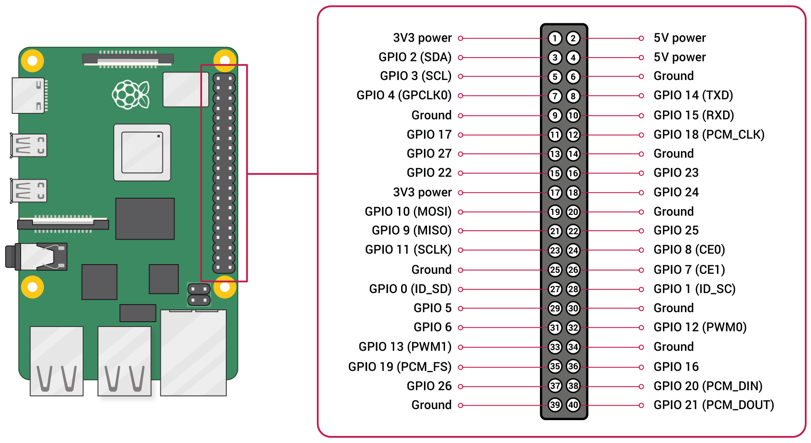
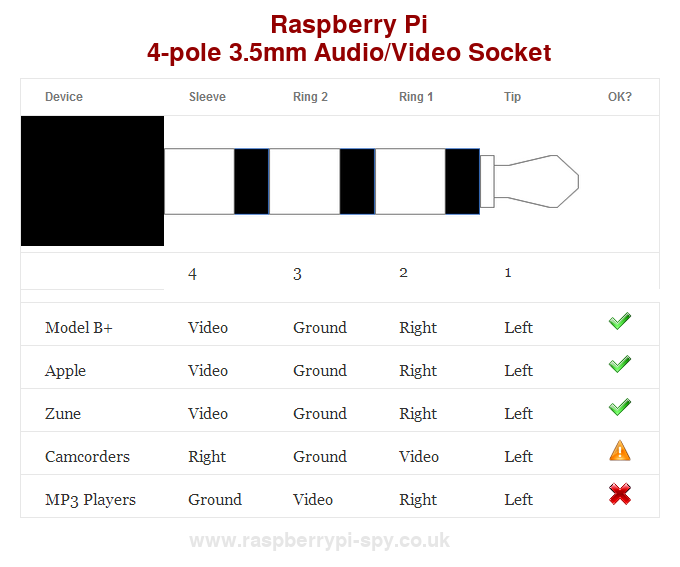

==================================================
Procédure d'installation du Raspberry Pi 4 Model B
==================================================

+--------------------+----------+----------------------------+
| Date               | Version  | Auteur                     |
+--------------------+----------+----------------------------+
| 15 juin 2024       | 1.0      | Franck Barbenoire          |
+--------------------+----------+----------------------------+

.. contents:: Table des matières
    :depth: 4

.. section-numbering::

.. raw:: pdf

   PageBreak oneColumn

.. header::
    ###Title###

.. footer::

    \- ###Page### -

Introduction
============

Ce document détaille la configuration matérielle et logicielle du calculateur.
Cela concerne un système de développement. Pour un système en production, on
utilise le projet Yocto (https://github.com/franckinux/yocto-domotik.git).

Ce document détaille également la procédure d'installation d'une carte Rasbperry
Pi 4 modèle B.

La procédure d'installation est décrite pour le système d'exploitation
Raspi OS (https://www.raspberrypi.com/software/operating-systems/).

Matériel
========

================================================ ===========
Désignation                                      Abréviation
================================================ ===========
Raspberry Pi 4, 2 ou 4 Gb de mémoire RAM         RPI
Coordinateur Zigbee                              ZIG
Relais carillon                                  CAR
Bouton sonnette                                  BUT
Horloge temps réel                               RTC
Compteur Linky                                   LKY
Convertisseur analogique numérique               ADC
Capteur de pression                              PRE
================================================ ===========

Bus
---

SPI
...

Non utilisé.

I2C
...

===== ========= ================
Carte Composant Adresse (7 bits)
===== ========= ================
PRE   BMP180A   0x77
RTC   DS3231    0x68
===== ========= ================

UART
....

===== ==== ============ ================ ======= =======
Carte Port Device       Configuration    Gpio Tx Gpio Rx
===== ==== ============ ================ ======= =======
ZIG   USB  /dev/ttyACM0 \-               \-      \-
LKY   \-   /dev/ttyAMA0 9600, 7, 1, E    14      15
\-    \-   /dev/ttyAMA1 \-               14      15
\-    \-   /dev/ttyAMA2 \-               0       1
\-    \-   /dev/ttyAMA3 \-               4       5
\-    \-   /dev/ttyAMA4 \-               8       9
\-    \-   /dev/ttyAMA5 \-               12      13
===== ==== ============ ================ ======= =======

Extrait de https://raspberrypi.stackexchange.com/questions/45570/how-do-i-make-serial-work-on-the-raspberry-pi3-pizerow-pi4-or-later-models/107780#107780 :

.. table:: Tableau d'affection des signaux des uarts

    ===== === === === === ========
    UART  TXD RXD CTS RTS Alt
    ===== === === === === ========
    uart0 14  15
    uart1 14  15
    uart2 0   1   2   3   I2C0
    uart3 4   5   6   7
    uart4 8   9   10  11  SPI0
    uart5 12  13  14  15  gpio-fan
    ===== === === === === ========

You CAN use uart2 on Pi4 but need to disable other uses of GPIO0/1 with
`force_eeprom_read=0` & `disable_poe_fan=1`.

Affectation des pins
--------------------

La table ci-dessous est l'inventaire des broches du bus du Raspberry Pi et de
leur affectation.

.. table:: Tableau d'affection des signaux du bus du Raspberry Pi

    === ==== ===========================================
    Pin Gpio Affectation
    === ==== ===========================================
    1   \-   3.3V
    2   \-   5V
    3   2    GPIO | **I2C - SDA**
    4   \-   5V
    5   3    GPIO | **I2C - SCL**
    6   \-   GND
    7   4    GPIO | GPCLK0 | UART /dev/ttyAMA3 - TX
    8   14   GPIO | UART /dev/ttyAMA0 - TX
    9   \-   GND
    10  15   GPIO
    11  17   GPIO
    12  18   GPIO | PCMCLK
    13  27   GPIO
    14  \-   GND
    15  22   GPIO
    16  23   **GPIO - out : Carillon**
    17  \-   3.3V
    18  24   **GPIO - in : Bouton de sonnette**
    19  10   GPIO | MOSI
    20  \-   GND
    21  9    GPIO | MISO | UART /dev/ttyAMA4 - RX
    22  25   GPIO
    23  11   GPIO | SCLK
    24  8    GPIO | CE0 | UART /dev/ttyAMA4 - TX
    25  GND  \-
    26  7    GPIO | CE1
    27  0    GPIO | ID_SD | UART /dev/ttyAMA2 - TX
    28  1    GPIO | ID_SC | UART /dev/ttyAMA2 - RX
    29  5    GPIO | UART /dev/ttyAMA3 - RX
    30  \-   GND
    31  6    GPIO
    32  12   GPIO | PWM0 | UART /dev/ttyAMA5 - TX
    33  13   GPIO | PWM1 | UART /dev/ttyAMA5 - RX
    34  \-   GND
    35  19   GPIO | PCM_FS
    36  16   GPIO
    37  26   GPIO
    38  20   GPIO | PCM_DIN
    39  \-   GND
    40  21   GPIO | PCM_DOUT
    === ==== ===========================================

    Détail du connecteur de 40 broches du Raspberry Pi 4 B

Installation
============

L'installation est décrite pour un Raspberry Pi 4 B.

Préparation de la carte SD
--------------------------

Télécharger l'image de la carte SD, la décompressser et l'écrire dans la carte
SD.

Bien vérifier la destination `/dev/sdX` (risque d'écrasement d'une
autre partition que celle souhaitée avec des conséquences dramatiques...).

.. code:: console

    $ wget https://downloads.raspberrypi.com/raspios_lite_arm64/images/raspios_lite_arm64-2024-03-15/2024-03-15-raspios-bookworm-arm64-lite.img.xz
    $ unxz 2024-03-15-raspios-bookworm-arm64-lite.img.xz
    $ sudo dd bs=1M if=2024-03-15-raspios-bookworm-arm64-lite.img of=/dev/sdX
    $ sudo sync

Activer la sortie vidéo composite
---------------------------------

Je ne disose pas du câble micro-HDMI ↔ HDMI, j'ai dû activer l'affichage par
la vidéo composite. Les signaux sont disponibles dans le connecteur jack à 4
contacts de type TRRS (Tip-Ring-Ring-Sleeve).

Le câble dont je disposais n'était pas le bon : Ground sur le contact 4
(Sleeve) et vidéo sur contact 3. J'ai dû le refaire avec :

- Vidéo composite sur contact 4 (Sleeve) ;
- Ground sur contact 3 ;
- Audio non connectée.

Source de l'image : https://forums.raspberrypi.com/viewtopic.php?t=83446

Avant de booter sur la carte SD, modifier les fichiers suivants :

- Ajouter à la fin du fichier `boot/cmdline.txt` avec un espace en guise de
  séparateur :

.. code:: console

    vc4.tv_norm=PAL

- Dans le fichier `boot/config.txt` :

  - Commenter la ligne suivante :

.. code:: console

    # dtoverlay=vc4-kms-v3d

-

  - Ajouter les lignes suivantes :

.. code:: console

    sdtv_mode=2
    hdmi_ignore_hotplug=1
    enable_tvout=1

-

  - Et modifier la ligne suivante :

.. code:: console

    disable_overscan=0

Premier boot sur la carte SD
----------------------------

Connexions de base :

- Un écran sur le port HDMI ou l'entrée vidéo composite ;
- Un clavier sur un port USB ;
- Un câble Ethernet entre le RPI une box.

Introduire la cartes SD dans le RPI et le mettre sous tension. Après la
séquence de boot, un menu de configuration appararaît :

- Configuration du clavier : `Other` puis  `French` puis `French` ;
- Création d'un nouvel utilisateur : `domotik` avec le mot de passe
  `h***s****h***` ;

Se connecter sous le compte précédemment créé puis mettre à jour les packages :

.. code:: console

    $ sudo apt update
    $ sudo apt full-upgrade

Mettre à jour le firmware du RPI :

.. code:: console

    $ sudo rpi-update
    $ sudo reboot

Communication par ssh
---------------------

Configurer une liaison avec le RPI par Ethernet ou Wifi. Dans ce dernier cas,
on peut utliser `rpi-config`.

Également, autoriser le protocle ssh sur le RPI :

.. code:: console

   $ sudo systemctl start ssh.service
   $ sudo systemctl enable ssh.service

Générer les clés ssh sur le PC qui va communiquer avec le RPI :

.. code:: console

   $ ssh-keygen -t ed25519 -C "domotik@domain.com"

Puis les transférer dans le RPI par ssh :

.. code:: console

   $ sh-copy-id -f -i .ssh/domotik.pub domotik@xxx.xxx.xxx.xxx

Et enfin, on peut se connecter en ssh :

.. code:: console

   $ ssh domotik@xxx.xxx.xxx.xxx

Fixer les paramètres réseau : adresse ip fixer sur l'interface Ethernet :

.. code:: console

    $ sudo nmtui

Une fois la connexion réseau établie avec le RPI, on peut désactiver la vidéo
composite.

Gestion des périphériques intégrés
----------------------------------

Pour autoriser le bus I2C, modifier les lignes suivantes du fichier
`/boot/config.txt` :

.. code:: console

    dtparam=i2c_arm=on

Pour interdire le Bluetooth et le Wifi, ajouter les lignes suivantes à la fin du
fichier `/boot/config.txt` :

.. code:: console

    # Disable Bluetooth
    dtoverlay=disable-bt
    # Disable Wifi
    dtoverlay=disable-wifi

Ajouter les lignes suivantes à la fin du fichier `/etc/modules` :

.. code:: console

    i2c-dev

Installation d'une horloge sauvegardée
--------------------------------------

Ajouter les lignes suivantes au fichier `/boot/config.txt` :

.. code:: console

    # Enable real time clock
    dtoverlay=i2c-rtc,ds3231

Supprimer un package :

.. code:: console

    $ sudo apt remove fake-hwclock

Si on utilise une autre source de temps (gps, dcf77, ...), on arrête la
synchronisation avec un serveur ntp :

.. code:: console

    $ sudo timedatectl set-ntp false

Modifier le fichier `/lib/udev/hwclock-set`. Mettre en commentaire ces trois
lignes :

.. code:: console

   #if [ -e /run/systemd/system ] ; then
   # exit 0
   #fi

Détermination du fuseau horaire
-------------------------------

.. code:: console

   timedatectl set-timezone Europe/Paris

Configuration de la liaison série
---------------------------------

Modifier le fichier `/boot/cmdline` et supprimer le texte depuis `console`
jusqu'à `115200`.

Ne pas démarrer un shell sur la liaison série.

.. code:: console

    $ sudo systemctl mask serial-getty@ttyAMA0.service

Installation de packages supplémentaires
----------------------------------------

.. code:: console

    $ sudo install git pigpio i2c-tools picocom
    $ sudo install python3-setuptools python3-pip

Démarrage du daemon `pigpiod` :

.. code:: console

    $ sudo systemctl start pigpiod
    $ sudo systemctl enable pigpiod

Arrêt de services
-----------------

.. code:: console

    $ sudo systemctl stop ModemManager.service
    $ sudo systemctl disable ModemManager.service

Installation de l'application
-----------------------------

Cloner l'application :

.. code:: console

    $ cd ~
    $ git clone https://github.com/franckinux/python3-domotik.git

Installer des packages Python supplémentaires :

.. code:: console

    $ pip install --user -r requirements.txt

Permettre de lancement de l'application au démarrage du RPI :

.. code:: console

    $ cd ~/domotik
    $ sudo cp python3-domotik.service /etc/systemd/system
    $ sudo systemctl enable python3-domotik.service
    $ sudo systemctl start python3-domotik.service

Zigbee
======

Mosquitto
---------

 Installer Mosquitto :

.. code:: console

    $ sudo apt install mosquitto
    $ sudo systemctl enable mosquitto
    $ sudo systemctl start mosquitto

Nodejs
------

.. code:: console

    $ sudo curl -fsSL https://deb.nodesource.com/setup_20.x | sudo -E bash -
    $ sudo apt install -y nodejs git make g++ gcc libsystemd-dev make
    $ node --version
    v20.13.1
    $ npm --version
    10.5.2
    $ sudo npm install -g npm@10.8.0

Zigbee2mqtt
-----------

Installation :

.. code:: console

    $ sudo mkdir /opt/zigbee2mqtt
    $ sudo chown -R ${USER}: /opt/zigbee2mqtt
    $ git clone --depth 1 https://github.com/Koenkk/zigbee2mqtt.git /opt/zigbee2mqtt
    $ cd /opt/zigbee2mqtt
    $ npm ci

    added 796 packages, and audited 797 packages in 5m

    86 packages are looking for funding
      run `npm fund` for details

    found 0 vulnerabilities
    npm notice
    npm notice New minor version of npm available! 10.5.2 -> 10.7.0
    npm notice Changelog: https://github.com/npm/cli/releases/tag/v10.7.0
    npm notice Run npm install -g npm@10.7.0 to update!
    npm notice

    $ npm run build

    > zigbee2mqtt@1.37.1 build
    > tsc && node index.js writehash

Configuration :

.. code:: console

    cp /opt/zigbee2mqtt/data/configuration.example.yaml /opt/zigbee2mqtt/data/configuration.yaml

Lancement :

.. code:: console

	$ npm start

	> zigbee2mqtt@1.37.1 start
	> node index.js

	[2024-05-13 21:18:53] info: 	z2m: Logging to console, file (filename: log.log)
	[2024-05-13 21:18:53] info: 	z2m: Starting Zigbee2MQTT version 1.37.1 (commit #c02c61d)
	[2024-05-13 21:18:53] info: 	z2m: Starting zigbee-herdsman (0.46.6)
	[2024-05-13 21:18:54] info: 	zh:zstack:znp: Opening SerialPort with {"path":"/dev/ttyACM0","baudRate":115200,"rtscts":false,"autoOpen":false}
	[2024-05-13 21:18:54] info: 	zh:zstack:znp: Serialport opened
	[2024-05-13 21:18:54] info: 	z2m: zigbee-herdsman started (resumed)
	[2024-05-13 21:18:54] info: 	z2m: Coordinator firmware version: '{"meta":{"maintrel":2,"majorrel":2,"minorrel":7,"product":2,"revision":20190425,"transportrev":2},"type":"zStack30x"}'
	[2024-05-13 21:18:54] info: 	z2m: Currently 0 devices are joined:
	[2024-05-13 21:18:54] info: 	z2m: Zigbee: disabling joining new devices.
	[2024-05-13 21:18:54] info: 	z2m: Connecting to MQTT server at mqtt://localhost
	[2024-05-13 21:18:55] info: 	z2m: Connected to MQTT server
	[2024-05-13 21:18:55] info: 	z2m: Started frontend on port 8080
	[2024-05-13 21:18:55] info: 	z2m: Zigbee2MQTT started!

	[2024-05-13 21:20:25] info: 	z2m: Zigbee: allowing new devices to join.
	[2024-05-13 21:20:58] info: 	zh:controller: Interview for '0x8cf681fffed7d4c7' started
	[2024-05-13 21:20:58] info: 	z2m: Device '0x8cf681fffed7d4c7' joined
	[2024-05-13 21:20:58] info: 	z2m: Starting interview of '0x8cf681fffed7d4c7'
	[2024-05-13 21:22:14] info: 	zh:controller: Succesfully interviewed '0x8cf681fffed7d4c7'
	[2024-05-13 21:22:14] info: 	z2m: Successfully interviewed '0x8cf681fffed7d4c7', device has successfully been paired
	[2024-05-13 21:22:14] info: 	z2m: Device '0x8cf681fffed7d4c7' is supported, identified as: HEIMAN Smart doorbell button (HS2SS-E_V03)
	[2024-05-13 21:22:14] info: 	z2m: Configuring '0x8cf681fffed7d4c7'
	[2024-05-13 21:22:22] info: 	z2m: Successfully configured '0x8cf681fffed7d4c7'

	^C
    [2024-05-13 21:25:10] info: 	z2m: Disconnecting from MQTT server
	[2024-05-13 21:25:10] info: 	z2m: Stopping zigbee-herdsman...
	[2024-05-13 21:25:12] info: 	zh:controller: Wrote coordinator backup to '/opt/zigbee2mqtt/data/coordinator_backup.json'
	[2024-05-13 21:25:12] info: 	zh:zstack:znp: closing
	[2024-05-13 21:25:12] info: 	zh:zstack:znp: Port closed
	[2024-05-13 21:25:12] info: 	z2m: Stopped zigbee-herdsman
	[2024-05-13 21:25:12] info: 	z2m: Stopped Zigbee2MQTT

Autostart
---------

Contenu du fichier `zigbee2mqtt.service` :

.. code:: console

	[Unit]
	Description=zigbee2mqtt
	After=network.target

	[Service]
	Environment=NODE_ENV=production
	Type=notify
	ExecStart=/usr/bin/node index.js
	WorkingDirectory=/opt/zigbee2mqtt
	StandardOutput=inherit
	# Or use StandardOutput=null if you don't want Zigbee2MQTT messages filling syslog, for more options see sys
	StandardError=inherit
	WatchdogSec=10s
	Restart=always
	RestartSec=10s
	User=domotik

	[Install]
	WantedBy=multi-user.target

.. code:: console

	$ sudo cp zigbee2mqtt.service /etc/systemd/system
	$ sudo systemctl daemon-reload
	$ sudo systemctl enable zigbee2mqtt.service
	$ sudo systemctl start zigbee2mqtt.service

Mettre à jour Zigbee2mqtt
-------------------------

.. code:: console

    $ cd /opt/zigbee2mqtt
    $ ./update.sh

Home Assistant
==============

Installer Python 3.12
---------------------

Suivre les instructions du site
`https://community.home-assistant.io/t/python-3-12-backport-for-debian-12-bookworm/709459` :

.. code:: console

    $ sudo apt update
    $ sudo apt upgrade -y
    $ wget -qO- https://pascalroeleven.nl/deb-pascalroeleven.gpg | sudo tee /etc/apt/keyrings/deb-pascalroeleven.gpg
    $ cat <<EOF | sudo tee /etc/apt/sources.list.d/pascalroeleven.sources
    Types: deb
    URIs: http://deb.pascalroeleven.nl/python3.12
    Suites: bookworm-backports
    Components: main
    Signed-By: /etc/apt/keyrings/deb-pascalroeleven.gpg
    EOF
    $ sudo apt update
    $ sudo apt install python3.12 python3.12-venv python3.12-dev

Installer Home Assistant
------------------------

Suivre les instructions du site
`https://www.home-assistant.io/installation/linux` :

.. code:: console

    $ sudo apt install -y bluez libffi-dev libssl-dev libjpeg-dev \
    zlib1g-dev autoconf build-essential \
    libopenjp2-7 libtiff6 libturbojpeg0-dev tzdata ffmpeg liblapack3 \
    liblapack-dev libatlas-base-dev
    $ sudo useradd -rm homeassistant
    $ sudo mkdir /srv/homeassistant
    $ sudo chown homeassistant:homeassistant /srv/homeassistant/
    $ sudo -u homeassistant -H -s
    $ cd /srv/homeassistant
    $ python3.12 -m venv .
    $ source bin/activate
    $ python3.12 -m pip install wheel
    $ pip3.12 install homeassistant==2024.5.4

Lancement
---------

Commencer par un démarrage manuel et quand c'est bon, passer au lancement
automatique.

Manuel :

.. code:: console

    hass

Automatique par systemd :

Suivre les instructions du site
`https://github.com/fracpete/home-assistant-systemd` :

.. code:: console

    $ git clone https://github.com/franckinux/home-assistant-systemd.git
    $ cd home-assistant-systemd
    $ sudo cp hass.sh /usr/local/bin
    $ sudo cp hass.service /etc/systemd/system
    $ sudo systemctl daemon-reload
    $ sudo systemctl enable hass
    $ sudo systemctl start hass

Mettre à jour Home Assistant
----------------------------

.. code:: console

    $ sudo systemctl stop hass
    $ sudo -u homeassistant -H -s
    $ cd /srv/homeassistant
    $ source bin/activate
    $ pip3.12 install -U homeassistant
    $ exit
    $ sudo systemctl start hass

Debug
-----

.. code:: console

    mosquitto_pub -t home/doorbell/timestamp -m "`date +%s`"
